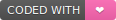
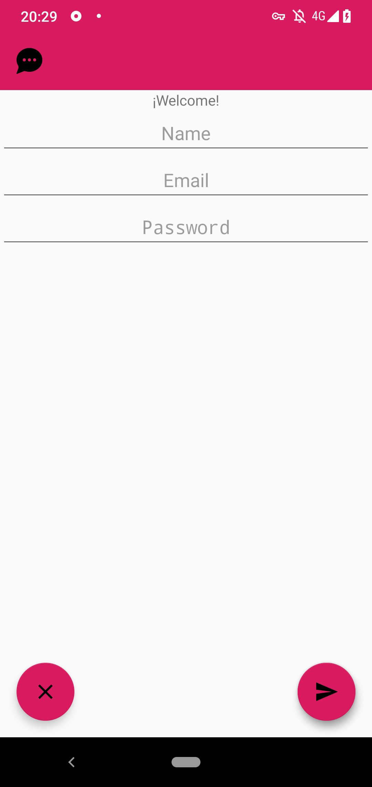
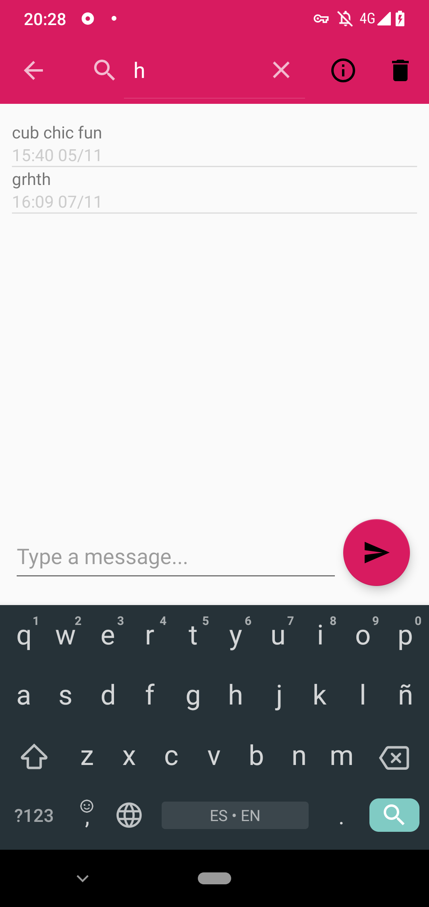
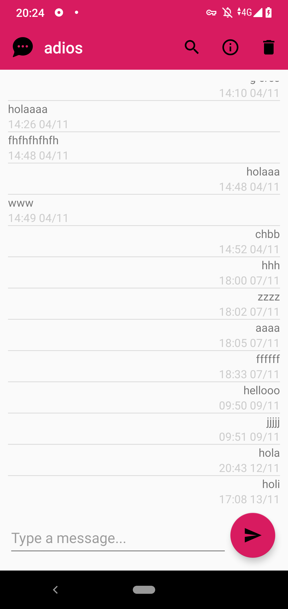
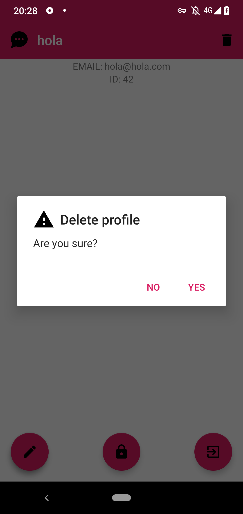
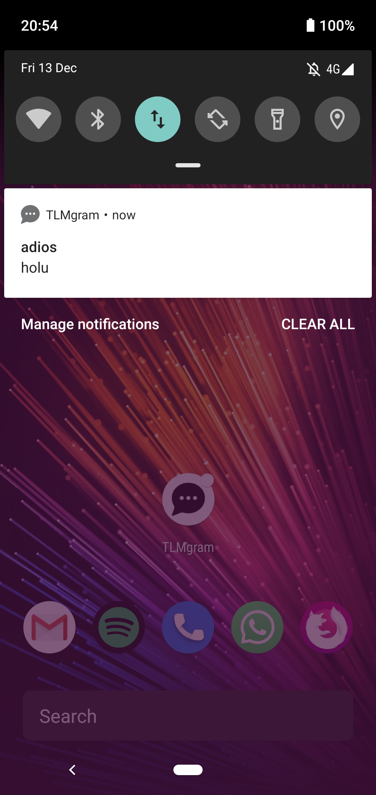

<h1 align="center">
 TLMgram
</h1>

  
   
Proyecto final de la asignatura <b>Desarrollo de Servicios de Comunicación en Red</b>
 
   
 
<a href="https://github.com/lassa97"><b>Fermin Lassa</b></a> y <a href="https://github.com/mariaove"><b>Maria Ovejero</b></a>

Login
===

Permite iniciar sesión o crear un usuario nuevo. Dependiendo del formulario rellenado, cambiará la acción a realizar.

Listado de chats
===

Muestra los chats de un usuario, destacando las conversaciones sin leer. Permite crear un nuevo chat, buscar una conversación o ver nuestro perfil.

Chat
===

Muestra los mensajes de una conversación. También nos permite buscar un mensaje, ver información sobre un chat o visitar el perfil del usuario al pulsar su nombre.

Mi perfil
===

Muestra nuestro perfil. Además, nos permite cambiar nuestro nombre, contraseña, cerrar sesión o eliminar nuestra cuenta. Manteniendo pulsado cada botón, obtenemos información sobre la acción a realizar.

User profile

===

Muestra el perfil de un usuario.

Chat info
===

Muestra la información de un chat.

Notificaciones
===

